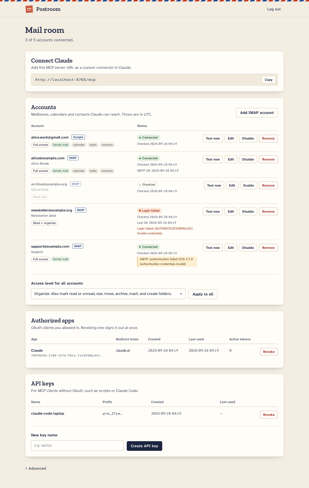
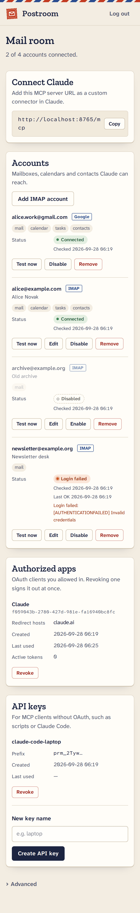
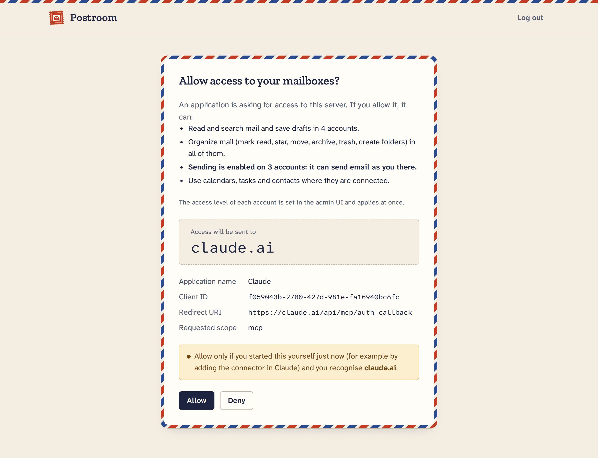
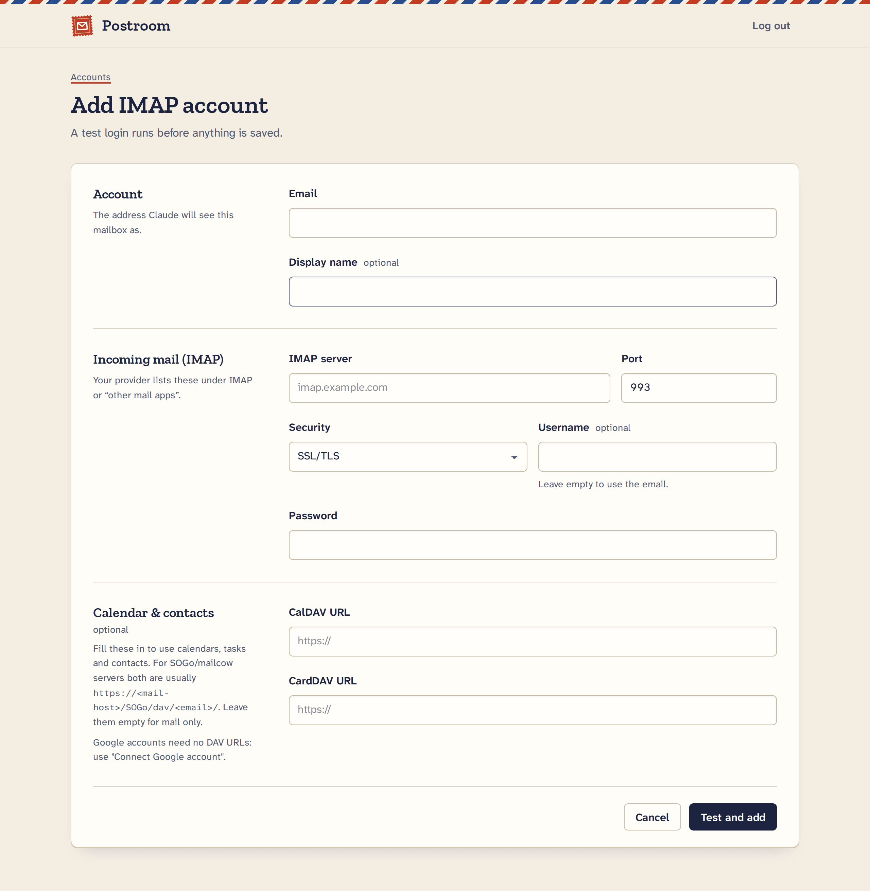

<p align="center">
  
</p>

<h1 align="center">Postroom</h1>

<p align="center">
  <strong>A self-hosted MCP server that gives Claude your mailboxes, calendars, tasks and contacts:<br>
  every account, one connector.</strong>
</p>

<p align="center">
  <a href="https://github.com/vaclav-kozak/postroom/actions/workflows/ci.yml"></a>
  <a href="https://github.com/vaclav-kozak/postroom/actions/workflows/docker.yml"></a>
  <a href="https://github.com/vaclav-kozak/postroom/pkgs/container/postroom"></a>
  <a href="LICENSE"></a>
</p>

<p align="center">
  
</p>

Postroom connects all of your email accounts (any IMAP server, plus Gmail and Google
Workspace), your calendars and task lists (CalDAV and Google Calendar/Tasks) and your
address books (CardDAV and Google Contacts) to Claude or any other
[MCP](https://modelcontextprotocol.io/) client. You run it on your own server; Claude talks
to it over HTTPS after you approve it once.

**Contents:** [Why Postroom](#why-postroom) · [Features](#features) ·
[MCP tools](#mcp-tools) · [Quick start](#quick-start) ·
[Own reverse proxy](#running-behind-your-own-reverse-proxy) ·
[Connecting clients](#connecting-clients) · [Adding accounts](#adding-accounts) ·
[Google setup](#google-setup) · [Configuration](#configuration) ·
[Security](#security-model) · [Operations](#operations) · [Development](#development) ·
[Roadmap](#roadmap)

## Why Postroom

Most mail integrations for AI assistants cover one provider, or run as a local process
that only a desktop app can start. Postroom is a remote server you own. It puts every
account you have behind one MCP endpoint, and it is careful by default about what an
assistant may change.

- **Works everywhere Claude does.** Postroom is a remote MCP server (Streamable HTTP with
  its own OAuth 2.1 authorization server), so it works as a custom connector in Claude on
  the web, on desktop and on mobile, and in Claude Code. It is not limited to local stdio
  clients.
- **All accounts in one place.** IMAP and Google accounts side by side: mail, calendars,
  tasks and contacts. Search all mailboxes at once, with results merged newest first.
- **Self-hosted.** Your mailbox passwords and Google tokens stay on your server,
  encrypted at rest with a key that never enters the database.
- **Safe by design.** Reading comes first, and a draft for you to review is the default
  way to compose. Each mailbox has an access level (read, organize or full), and sending
  is off until you turn it on for an account. Nothing is ever deleted permanently, the
  calendar tools never invite anyone, and every tool carries MCP annotations, so clients
  ask before a destructive action.

## Features

**Mail**
- Any IMAP server (SSL/TLS or STARTTLS), plus Gmail and Google Workspace through Google
  sign-in or with an app password.
- Search one, several or all accounts; Gmail accounts accept Gmail search syntax.
- Read emails as text (HTML is converted), follow threads (Gmail's native threads, or
  `Message-ID`/`References` elsewhere), and read attachments: text, PDF text and images.
- Save drafts, including threaded replies, for you to review.
- Organise: mark read or unread, star, move, archive (Gmail-aware), move to Trash and
  create folders. Batch calls take up to 500 emails across accounts.
- Send, reply, reply-all, forward and send a saved draft over SMTP, with attachments,
  a copy in Sent, a per-account hourly limit and a guard against sending the same email
  twice. Sending is opt-in per account.

**Calendar and tasks**
- Google Calendar and Google Tasks, and any CalDAV server (calendars and VTODO task lists).
- List events across calendars and accounts; create, update and delete events.
- List, create, update, complete and delete tasks.
- Nothing is ever sent to other people: the tools accept no attendees, and events or
  tasks that have attendees or repeat are read-only.

**Contacts**
- Search Google Contacts (including "other contacts") and CardDAV address books by name,
  email, phone or organization.

**Security and admin**
- Owner-only admin web UI: add, test, edit, disable and remove accounts, set access
  levels, connect Google accounts, see and revoke authorized apps, create API keys.
- OAuth 2.1 authorization server with PKCE, dynamic client registration restricted to
  allow-listed redirect hosts, and a consent screen for every new client.
- Secrets encrypted with AES-256-GCM, an argon2id admin password, login lockout, CSRF
  protection and per-IP rate limits.
- Bounded memory for huge or hostile mail and PDFs; runs in a 256 MiB container.
- Background health checks that stop at the first failed login, so a changed password
  does not get your server banned by fail2ban.

<p align="center">
  
</p>

## MCP tools

Postroom exposes 25 tools. `account` is always the account's email address, as
`list_accounts` returns it. Mail tools need the account's [access level](#access-levels)
shown in the last column, and the send tools have extra
[safeguards](#sending-safeguards). Calendar, task and contact tools need the account to
have that capability: Google accounts have all three, IMAP accounts have them when
CalDAV/CardDAV URLs are set.

### Mail

| Tool | What it does | Access level |
|---|---|---|
| `list_accounts` | Lists the accounts with their status, access level and capabilities. | read |
| `list_folders` | Lists an account's folders and their special use (sent, drafts, junk, ...); optional message counts. | read |
| `search_emails` | Searches one, several or all accounts by text, sender, recipient, subject, date range, unread or attachment; paged, merged newest first. | read |
| `get_email` | Reads one email: headers, body as text and the attachment list. Does not mark it read. | read |
| `get_thread` | Lists the conversation an email belongs to, oldest first. | read |
| `get_attachment` | Returns one attachment: text and PDF as extracted text, PNG/JPEG/GIF/WebP as images, other types as metadata. | read |
| `create_draft` | Saves a new email or a threaded reply in the Drafts folder. Sends nothing. | read |
| `mark_emails` | Marks emails read or unread, flagged or unflagged. | organize |
| `move_emails` | Moves emails to another folder or an alias (`inbox`, `archive`, `junk`, `trash`, `all`). | organize |
| `trash_emails` | Moves emails to Trash. Nothing is deleted permanently. | organize |
| `create_folder` | Creates a folder, optionally inside another one. | organize |
| `send_email` | Sends a new email, reply or reply-all immediately, with optional attachments (up to 2 MiB). Takes `allow_duplicate`. | full + SMTP |
| `forward_email` | Forwards an email immediately, with its attachments unless told not to. Takes `allow_duplicate`. | full + SMTP |
| `send_draft` | Sends one of the account's own saved drafts as it is and removes it from Drafts. Takes `allow_duplicate`. | full + SMTP |

### Calendar and tasks

| Tool | What it does | Needs |
|---|---|---|
| `list_calendars` | Lists the calendars of one account or of all accounts. | calendar |
| `list_events` | Lists events in a range of up to 366 days, across calendars and accounts; optional text filter. | calendar |
| `create_event` | Creates an event (timed or all-day) in the primary or a given calendar. No attendees. | calendar |
| `update_event` | Changes an event's title, time, location or description. | calendar |
| `delete_event` | Deletes an event. | calendar |
| `list_task_lists` | Lists the task lists of one account or of all accounts. | tasks |
| `list_tasks` | Lists open (optionally also completed) tasks. | tasks |
| `create_task` | Creates a task with optional notes and due date. | tasks |
| `update_task` | Changes a task, or marks it completed or open again. | tasks |
| `delete_task` | Deletes a task. | tasks |

### Contacts

| Tool | What it does | Needs |
|---|---|---|
| `search_contacts` | Searches contacts by name, email, phone or organization, in one or all accounts. | contacts |

Notes:

- The read tools are annotated read-only. `move_emails`, `trash_emails`, the three send
  tools and the two delete tools are annotated destructive, so well-behaved clients ask
  before running them.
- Events and tasks that have attendees or repeat can be read but not changed or deleted,
  so Postroom never sends an invitation or a cancellation.
- **Time zone.** Date-times without a UTC offset are read in the server's time zone,
  `POSTROOM_TIMEZONE` (default `UTC`). New calendar events are stored in that zone, event
  times are returned in it, and the admin UI shows times in it. The server tells clients
  the zone in its instructions, and `list_calendars` returns it as `time_zone`. Give an
  offset (`2026-10-05T09:00:00+02:00`) to be exact.
- Limits: `search_emails` returns 1-100 results per page; the batch tools take up to 500
  emails; `send_email` attachments total at most **2 MiB** (decoded); `forward_email`
  re-attaches at most 20 MiB; `send_draft` sends drafts of up to 25 MiB. For files larger
  than 2 MiB, forward an email that has them, or attach them to a draft yourself and let
  the client call `send_draft`.

### Sending safeguards

The three send tools send immediately, so they carry extra checks:

- **Opt-in.** An account can send only at access level **full** with an outgoing server
  (see [Access levels](#access-levels)). Every account starts at **organize**.
- **No accidental duplicates.** An identical send (same account, recipients, subject, body
  and attachments) within 10 minutes of the first is refused, and so is sending the same
  draft (by its `Message-ID`) again within an hour. Each send tool takes
  `allow_duplicate` (default `false`); the tool descriptions tell clients to set it only
  when you ask for a second copy. The record is kept in memory, so a restart clears it.
- **No automatic retries.** A send that times out after the message data started may
  already have gone out: the tool says so and tells the client to check Sent
  (`search_emails` with `folder='sent'`) and ask you, never to retry on its own. A timeout
  before that point says nothing was sent. If the connection drops while the message is
  being handed over, the copy in Sent carries the keyword **`$MaybeSent`** (on servers that
  support keywords) and the tool says "do not retry automatically".
- **`send_draft`** sends only the account's own drafts: the message needs the `\Draft` flag
  and a `From` (and `Sender`, if present) that is one of the account's addresses, even
  when it is in the Drafts folder. Two calls for the same draft never send it twice.
- **SMTP logins** make exactly one AUTH attempt (PLAIN, else LOGIN; a server offering
  neither is refused with a clear message). A password rejection (5xx) pauses sending from
  that account until you press **Test now**; a temporary refusal (4xx) does not.
  Accounts connected with Google OAuth refresh their token once and never pause.

## Quick start

This runs Postroom with the bundled [Caddy](https://caddyserver.com/), which gets and
renews a Let's Encrypt certificate automatically.

**You need:**
- a Linux server with Docker and Docker Compose v2.24 or newer;
- a domain or subdomain (for example `mcp.example.com`) whose DNS record points at the
  server;
- ports 80 and 443 open to the internet.

**1. Get the files.**

```sh
git clone https://github.com/vaclav-kozak/postroom.git
cd postroom
```

Only `docker-compose.yml`, `deploy/caddy/Caddyfile` and `.env.example` are needed, so you
can also download just those three files, keeping the same layout.

**2. Set the address.**

```sh
cp .env.example .env
```

Edit `.env` and set both lines to your domain:

```sh
POSTROOM_DOMAIN=mcp.example.com
POSTROOM_PUBLIC_URL=https://mcp.example.com
```

**3. Generate the secrets.** This appends the master key, the session secret and the admin
password hash to `.env`, and prints the admin password on the terminal. Store the password
in your password manager.

```sh
docker compose --progress quiet run --rm --no-deps -T postroom \
  postroom gen-secrets --env-out /dev/stdout --password-out /dev/stderr \
  | grep '^POSTROOM_' >> .env
```

**4. Start it.**

```sh
docker compose up -d
```

**5. Log in** at `https://mcp.example.com/login` with the printed password, add your
accounts, and [connect Claude](#connecting-clients).

> **Image tags.** The compose file pulls `ghcr.io/vaclav-kozak/postroom:latest`. Set
> `POSTROOM_VERSION` in `.env` to pin a release (`0.1.0`, `0.1`), or to `edge` for the
> current `main` branch. To build the image yourself, uncomment `build: .` in the compose
> file.

## Running behind your own reverse proxy

If the server already runs nginx, Traefik or Caddy, use `docker-compose.proxy.yml`. It
starts Postroom alone and publishes it on `127.0.0.1:8000` only (change the port with
`POSTROOM_PORT`). Add `-f docker-compose.proxy.yml` to every compose command:

```sh
cp .env.example .env        # set POSTROOM_PUBLIC_URL (POSTROOM_DOMAIN is not used here)
docker compose --progress quiet -f docker-compose.proxy.yml run --rm --no-deps -T postroom \
  postroom gen-secrets --env-out /dev/stdout --password-out /dev/stderr \
  | grep '^POSTROOM_' >> .env
docker compose -f docker-compose.proxy.yml up -d
```

[`deploy/nginx/postroom.conf.example`](deploy/nginx/postroom.conf.example) is a complete
nginx site: TLS, HSTS, a rate limit on the login and OAuth endpoints, 4 MB bodies and
unbuffered streaming on `/mcp` (1 MB elsewhere), and no access log (query strings can carry
one-time OAuth codes).

Your proxy must:

- terminate TLS and pass requests to `http://127.0.0.1:8000`;
- **set or overwrite** `X-Forwarded-For` with the client's address (not append to a value
  the client sent), and preferably also set `X-Real-IP` and `X-Forwarded-Proto`;
- allow request bodies of 4 MB on `/mcp` (for `send_email` attachments; 1 MB is enough
  everywhere else) and not buffer its responses. Postroom itself accepts at most 4 MiB per
  MCP request, so a larger limit gains nothing.

**Client addresses.** Postroom believes `X-Forwarded-For`, `X-Real-IP` and
`X-Forwarded-Proto` only from the addresses in `POSTROOM_TRUSTED_PROXIES` and removes them
from everyone else, so a client cannot fake its address to dodge the login lockout or the
rate limit. Both compose files trust the private ranges
(`10.0.0.0/8,172.16.0.0/12,192.168.0.0/16,fc00::/7`), which covers a proxy on the host
(it connects through the Docker bridge gateway) and a proxy container. Outside Docker the
default is loopback only. If every failed login in the log shows the same address, your
proxy is not trusted: add its address to `POSTROOM_TRUSTED_PROXIES`.

## Connecting clients

The MCP endpoint is `https://<your domain>/mcp`. The admin dashboard shows it with a copy
button.

### Claude (web, desktop and mobile)

1. In Claude, open **Settings → Connectors** and choose **Add custom connector**.
2. Enter a name (for example "Postroom") and the URL `https://mcp.example.com/mcp`.
3. Claude opens Postroom's login page. Log in with the admin password.
4. The consent screen shows which app is asking, where the access will be sent and what
   it will be allowed to do. Click **Allow** only if you started this yourself just now.

A connector added on claude.ai is available in the desktop and mobile apps too. The
approved app then appears under **Authorized apps** in the admin, where you can revoke it.

<p align="center">
  
</p>

### Claude Code

With OAuth (a browser window opens for the login and consent):

```sh
claude mcp add --transport http postroom https://mcp.example.com/mcp
```

Or with an API key, created in the admin under **API keys** (or with
`postroom create-api-key <name>`):

```sh
claude mcp add --transport http postroom https://mcp.example.com/mcp \
  --header "Authorization: Bearer prm_..."
```

### Other MCP clients

Any client that supports Streamable HTTP can connect to `https://<your domain>/mcp`:

- **OAuth 2.1:** Postroom publishes its authorization server metadata, supports dynamic
  client registration and requires PKCE (S256). Registration accepts `https` redirect URIs
  only on the hosts in `POSTROOM_OAUTH_REDIRECT_HOSTS` (exact match; default
  `claude.ai,claude.com`), and `http` redirect URIs only on loopback (`localhost`,
  `127.0.0.1`, `::1`), which is what local clients such as Claude Code use. To connect a
  web-based client that redirects to another host, add that host, for example
  `POSTROOM_OAUTH_REDIRECT_HOSTS=claude.ai,claude.com,app.example.org`, and restart.
- **API key:** send `Authorization: Bearer prm_...` with every request. An API key has the
  same rights as an approved OAuth client and does not expire; revoke it when you no longer
  need it.

## Adding accounts

Log in to the admin and use **Add IMAP account** or **Connect Google account**. Saving an
IMAP account first tests the login (and the SMTP login, if set), so mistakes show up at
once. After that, a background check tests every account every 6 hours.

<p align="center">
  
</p>

### IMAP accounts

Enter the email address, IMAP server, port, security (SSL/TLS or STARTTLS), an optional
username (the email address is used when it is empty) and the password. Providers with
two-step sign-in, such as iCloud, Fastmail and Yahoo, need an **app password** created in
the provider's account settings; your normal password will not work.

**Gmail and Google Workspace** can be added in two ways:

- **Connect Google account** (see [Google setup](#google-setup)) signs in with Google OAuth
  and brings mail, calendars, tasks and contacts. It needs a Google OAuth client of your
  own.
- As an **IMAP account with an app password**: IMAP server `imap.gmail.com` (993, SSL/TLS),
  SMTP server `smtp.gmail.com` (465, SSL/TLS), and a
  [Google app password](https://support.google.com/accounts/answer/185833) (it needs
  2-Step Verification). This gives mail only: Google's calendars and contacts need OAuth.
  Postroom still treats the mailbox as Gmail (Gmail search syntax, native threads, archive
  to All Mail).

**Outgoing mail (SMTP)** is optional. Fill in the SMTP server to let Postroom send from the
account; the form suggests one based on the IMAP host. Security is SSL/TLS (usually port
465) or STARTTLS (usually 587). SMTP signs in with the same password as IMAP, and the
username defaults to the IMAP username. Without an SMTP server the account can still be
read and organised, and drafts can be saved. Google accounts send through Gmail with their
Google sign-in and need no SMTP settings.

**Calendar and contacts** are optional too: enter a CalDAV URL for calendars and tasks and
a CardDAV URL for contacts. Postroom discovers the calendars and address books from there
and signs in with the same username and password as IMAP. The URLs must be `https`
(`http` is accepted only for `localhost`). The [provider guide](docs/providers.md) lists
the settings for common providers.

**Microsoft 365 and Outlook.com are not supported.** Microsoft has turned off password
sign-in for IMAP and SMTP, and Postroom has no Microsoft OAuth yet. It is on the
[roadmap](#roadmap).

### Access levels

Each account has a mail access level. Set it on the account's **Edit** page in the admin,
with `postroom set-access <email> <read|organize|full>`, or for every account at once with
`postroom set-access --all <level>` or the dashboard's **Access level for all accounts**
control (shown when there are two or more accounts). A change applies immediately, also
to clients that are already connected.

| Level | What MCP clients may do with the account's mail |
|---|---|
| **Read** | Search and read mail, and create drafts. |
| **Organize** | Also mark read or unread, star, move, archive, trash, and create folders. |
| **Full** | Also send, reply, forward and send drafts (needs an SMTP server, or a Google account). |

Every account starts at **Organize** (new, Google and imported accounts alike): sending is
opt-in. Raise an account to **Full** only if an assistant should send from it, and lower
it to **Read** for any mailbox an assistant should only read. Access levels apply to mail
only; calendar, task and contact tools are not affected.

## Google setup

Gmail, Google Calendar, Google Tasks and Google Contacts need a Google OAuth client of your
own. You set it up once, in about ten minutes. The step-by-step guide is in
**[docs/google-setup.md](docs/google-setup.md)**; in short:

1. Create a project in the [Google Cloud console](https://console.cloud.google.com/).
2. Enable the **Google Calendar API**, **Google Tasks API** and **People API**. Gmail is
   reached over IMAP and SMTP, so the Gmail API is not needed.
3. Configure the **OAuth consent screen**: user type External (or Internal for a Google
   Workspace organization), yourself as a test user, and the scopes Postroom asks for:
   `https://mail.google.com/`, `.../auth/calendar.events`, `.../auth/calendar.readonly`,
   `.../auth/tasks`, `.../auth/contacts.readonly` and `.../auth/contacts.other.readonly`
   (plus `openid` and `email`).
4. **Publish the app** ("In production"). While an External app is in "Testing", Google
   expires its refresh tokens after 7 days and you would have to reconnect every week. A
   published app that only you use can stay unverified: Google shows a "Google hasn't
   verified this app" warning when you connect, and you click through it.
5. Create an **OAuth client ID** of type **Web application** with the authorized redirect
   URI `https://mcp.example.com/admin/google/callback`.
6. Put the client ID and secret into `.env` as `POSTROOM_GOOGLE_CLIENT_ID` and
   `POSTROOM_GOOGLE_CLIENT_SECRET`, run `docker compose up -d`, and click **Connect Google
   account** in the admin.

On a Google Workspace domain, the Workspace admin may have to trust the OAuth client ID
first (Admin console → Security → Access and data control → API controls).

## Configuration

Postroom reads its settings from environment variables; with Docker Compose they come from
`.env`. [`.env.example`](.env.example) documents each one.

| Variable | Default | Description |
|---|---|---|
| `POSTROOM_PUBLIC_URL` | `http://localhost:8000` | The public base URL, without a path. It must be `https://<POSTROOM_DOMAIN>`: OAuth metadata, redirect URIs and the MCP URL are built from it, and `https` turns on Secure cookies. |
| `POSTROOM_MASTER_KEY` | required | Base64 AES-256 key that encrypts every stored password and token. Generated by `gen-secrets`. **Back it up:** without it the stored secrets are lost. |
| `POSTROOM_SESSION_SECRET` | required | Signs the admin session cookies. Generated by `gen-secrets`. |
| `POSTROOM_ADMIN_PASSWORD_HASH_B64` | empty | Base64 argon2 hash of the admin password, from `gen-secrets` or `set-password`. Empty means nobody can log in. |
| `POSTROOM_GOOGLE_CLIENT_ID` | empty | Google OAuth client ID. Google accounts are enabled when both Google settings are set. |
| `POSTROOM_GOOGLE_CLIENT_SECRET` | empty | Google OAuth client secret. |
| `POSTROOM_OAUTH_REDIRECT_HOSTS` | `claude.ai,claude.com` | Hosts (exact match, comma-separated) on which MCP clients may register `https` redirect URIs. `http` on loopback is always allowed. |
| `POSTROOM_AUTH_RATE_LIMIT_PER_MINUTE` | `10` | Requests per minute per client IP to `/login`, `/register`, `/authorize` and `/token` (burst 10). `0` disables the limit. |
| `POSTROOM_TRUSTED_PROXIES` | `127.0.0.1,::1` (compose files: the private ranges) | IPs or CIDRs of reverse proxies whose forwarding headers are believed. |
| `POSTROOM_SEND_LIMIT_PER_HOUR` | `60` | Emails one account may send in any 60 minutes, across `send_email`, `forward_email` and `send_draft`. `0` means no limit. |
| `POSTROOM_TIMEZONE` | `UTC` | IANA time zone (for example `Europe/Berlin` or `America/New_York`) for date-times given without a UTC offset, new calendar events and the times shown in the admin UI. An unknown name stops Postroom at startup with a configuration error. |
| `POSTROOM_CHECK_INTERVAL_SECONDS` | `21600` | Seconds between background account checks and maintenance. `0` turns them off. |
| `POSTROOM_DB_PATH` | `./data/postroom.db` (image: `/data/postroom.db`) | The SQLite database file. Change it only when running without Docker. |

Used by the compose files only:

| Variable | Default | Description |
|---|---|---|
| `POSTROOM_DOMAIN` | none | The domain Caddy gets a certificate for (`docker-compose.yml`). |
| `POSTROOM_VERSION` | `latest` | Image tag: `latest`, a release such as `0.1.0` or `0.1`, or `edge` (the `main` branch). |
| `POSTROOM_PORT` | `8000` | Host port on `127.0.0.1` (`docker-compose.proxy.yml`). |

## Security model

Postroom holds the keys to all of your mail, so it is strict by design. The short version
is below; [docs/security.md](docs/security.md) has the details, and
[SECURITY.md](SECURITY.md) has the threat model and how to report a vulnerability.

- **One owner.** The admin UI has a single user, with an argon2id-hashed password, a login
  lockout (5 failures per IP in 15 minutes, 20 in total in an hour), CSRF tokens on every
  form, and server-side logout that ends every session. Changing the password ends them too.
- **OAuth 2.1.** PKCE with S256 only, dynamic client registration restricted to
  allow-listed redirect hosts, your explicit consent for every client, one-hour access
  tokens, and rotating refresh tokens: reusing an old one revokes the whole token family.
  Tokens and API keys are stored only as hashes.
- **Encrypted secrets.** Account passwords and Google refresh tokens are encrypted with
  AES-256-GCM under `POSTROOM_MASTER_KEY`, which never enters the database. The database
  alone is useless to a thief; if you lose the key, you re-enter the passwords.
- **Careful input handling.** IMAP arguments containing CR, LF or NUL are refused, so
  nothing can inject IMAP commands. CalDAV/CardDAV credentials go only to `https` URLs. Big
  mail is read part by part, and PDFs are parsed in a child process with a memory limit.
- **Limits.** Per-IP rate limits on the login and OAuth endpoints, per-account access
  levels with sending off by default, an hourly send limit per account, and a
  duplicate-send guard.
- **If a token is stolen,** whoever holds it can do what the approved app could do (within
  each account's access level) until you revoke it. **Admin → Authorized apps → Revoke**
  ends all of that app's tokens at once, and **API keys → Revoke** ends a key. Disabling an
  account or lowering its access level also takes effect immediately.

Please report vulnerabilities privately, as described in [SECURITY.md](SECURITY.md).

## Operations

**Backups.** Back up two things: the `postroom_postroom-data` volume (the SQLite database
with accounts, encrypted secrets and OAuth clients) and your `.env`. The database is useless
without `POSTROOM_MASTER_KEY`, so keep the key safe and separate from the backups. To take
a consistent copy while Postroom runs:

```sh
docker compose exec postroom python -c "import sqlite3; s=sqlite3.connect('/data/postroom.db'); d=sqlite3.connect('/data/backup.db'); s.backup(d)"
docker compose cp postroom:/data/backup.db ./postroom-backup.db
```

**Upgrading.** Database migrations run automatically at startup.

```sh
docker compose pull && docker compose up -d
```

**Logs.** `docker compose logs -f postroom`. Postroom never logs passwords, tokens or email
content, and keeps no access log.

**Health.** `GET /healthz` returns `{"status": "ok"}`; the image's Docker health check uses
it.

**Changing the admin password.** Run
`docker compose run --rm --no-deps postroom postroom set-password`, replace the
`POSTROOM_ADMIN_PASSWORD_HASH_B64` line in `.env` with the printed line, and run
`docker compose up -d`. All admin sessions end.

**Command line.** Run a command with `docker compose exec postroom postroom <command>`
(or `uv run postroom <command>` in a checkout):

| Command | What it does |
|---|---|
| `serve [--host H] [--port P]` | Runs the HTTP server (the container's default command). |
| `gen-secrets --env-out F --password-out F` | Generates the master key, the session secret and an admin password with its hash. |
| `set-password [--stdin]` | Prints a new `POSTROOM_ADMIN_PASSWORD_HASH_B64` line. |
| `hash-password` | Hashes a password read from stdin. |
| `list-accounts` | Lists the accounts with status, access level and last error. |
| `set-access EMAIL LEVEL` | Sets an account's mail access level: `read`, `organize` or `full`. `set-access --all LEVEL` sets every account at once. |
| `check-accounts [--email E ...]` | Tests accounts now (never retries accounts whose login failed). |
| `create-api-key NAME` | Creates an MCP API key and prints it once. |
| `list-api-keys` | Lists API keys (never the keys themselves). |
| `revoke-api-key ID` | Revokes an API key. |
| `import-emclient PATH` | Imports accounts from an eM Client export (see [Advanced](#advanced)). |

## Development

You need [uv](https://docs.astral.sh/uv/), which installs Python 3.13 for you. The
integration tests need Docker.

```sh
uv sync
uv run pytest -q                    # unit tests
uv run pytest -m integration -q     # against GreenMail (IMAP/SMTP) and Radicale (CalDAV/CardDAV)
uv run ruff check . && uv run ruff format --check .
```

[CONTRIBUTING.md](CONTRIBUTING.md) explains how to run the server locally and what a pull
request needs.

## Advanced

Moving from eM Client? Postroom can import IMAP accounts from an eM Client settings export:
see [docs/advanced/emclient-import.md](docs/advanced/emclient-import.md).

## Roadmap

Ideas, not promises:

- Microsoft 365 and Outlook.com through Microsoft OAuth.
- Editing contacts.
- Notifications about new mail (IMAP IDLE), if MCP clients come to support them well.

## License

Postroom is licensed under the [Apache License 2.0](LICENSE).
